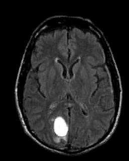
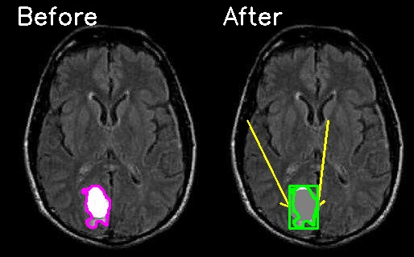

# Simulation of da Vinci Surgical System

## Overview

This project simulates the functionality of the da Vinci Surgical System, a sophisticated robotic surgical system used in minimally invasive surgeries. The simulation incorporates robotic arm movements, image processing techniques to detect tumors in brain images, and visual feedback mechanisms. The code is implemented in Python using OpenCV and NumPy libraries.

## Features

- **Robotic Arm Simulation:** Simulates the movement of a robotic arm to the tumor's location.
- **Image Processing:** Detects and highlights tumor areas in brain images.
- **Visual Feedback:** Displays the original and processed images side by side with annotations.
- **User Interaction:** Allows for simulated control of the robotic arm and camera.

## Requirements

To run this project, you need to have the following installed:

- Python 3.x
- OpenCV (`opencv-python` package)
- NumPy (`numpy` package)

You can install the required packages using pip:

```bash
pip install -r requer.txt
```


## View Results
The simulation will process the image, detect tumors, and display the results. The combined image showing the "Before" and "After" states will be saved as surgery_result.jpg in the project directory.

## Sample Input

Below is a sample Input of the project, that we uses:
Main Picture (Before Surgery)




This image shows the original brain MRI with the detected tumor highlighted in purple.
Result Picture (Before and After Surgery)



This image displays the processed brain MRI after the tumor has been removed, with the tumor area marked in green and a darker highlight.


## Documentation

For a detailed explanation of the project and its components in Persian, please refer to the following document:

[Persian Document on Google Docs](https://docs.google.com/document/d/1tc2sFyFv4qnWBKGIZp51objYXnKQNl82DMkY52f90go/edit?usp=sharing)


